 

## Sobre

Movido pela resolução de problemas complexos e pela busca por eficiência técnica, unindo minha
base em Ciência da Computação na Anhembi Morumbi a uma visão estratégica de produto. Transito
entre a precisão do desenvolvimento de software e a criação de interfaces que priorizam a
experiência do usuário, sempre com foco em performance e escalabilidade.

Hoje colaboro com uma das maiores referências do varejo nacional (**Lojas Marisa**), transformando
dados brutos em insights que direcionam páginas e fluxos de alta conversão.

- 🔐 Segurança pensada desde o desenho da solução, não só no deploy
- 🧱 Separação clara entre interface, regra de negócio, dados e operação
- 🤖 Automação de tarefas repetitivas para ganhar escala e reduzir erro
- ✅ Testes, scripts e documentação sustentando a evolução contínua

## Stack

| | |
|---|---|
| **Backend & Linguagens** | Java · Spring Boot · Spring Security · Spring Data JPA · Node.js · TypeScript · Python · PHP |
| **Dados & Banco** | PostgreSQL · MySQL · SQL · Hibernate / JPQL · Pandas |
| **DevOps & Qualidade** | Docker · Git / GitHub Actions · JUnit · Testes de integração |
| **Design & Produto** | Figma · UX/UI Design · Design System · UX Research |

## Projetos em destaque

| Projeto | O que é | Stack |
|---|---|---|
| [**E-commerce API**](https://github.com/Guilhr-07/ecommerce-api) | Catálogo com JWT stateless, leitura pública/escrita protegida, upload de imagens e Swagger | Java 21 · Spring Security · JWT · PostgreSQL · OpenAPI |
| [**Controle Financeiro API**](https://github.com/Guilhr-07/controle-financeiro-api) | Finanças pessoais com resumo mensal agregado no banco via JPQL, precisão monetária | Java 21 · Spring Boot · PostgreSQL · JUnit 5 |
| [**Gestor de Tarefas API**](https://github.com/Guilhr-07/gestor-tarefas-api) | API REST em camadas, erros padronizados (RFC 7807), testes de integração | Java 21 · Spring Data JPA · H2/PostgreSQL |

→ Portfólio completo com case studies em [guilherme-portfolio.dev](https://guilherme-portfolio.dev)

## GitHub

---

São Paulo, Brasil · Disponível para vagas Backend / Full-Stack Júnior

