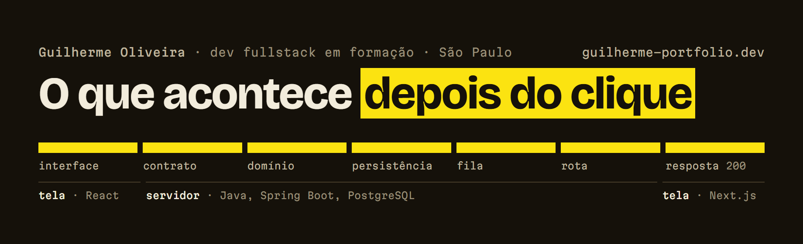

 

## Sobre

Vim do design. Trabalho com UX/UI no time de CRO da Lojas Marisa: página de produto, checkout e
landing pages decididos pelo comportamento da cliente. Toda mudança na tela vira número, e isso
me deixou curioso pelo outro lado: como o dado é guardado, validado e devolvido. Fui estudar essa parte.

Hoje estudo Ciência da Computação na Anhembi Morumbi (formatura em 2028) e faço as duas pontas:
API em Java e Spring no servidor, React e Next.js na tela.

O que veio do design eu não larguei: quando desenho uma resposta de erro, penso em quem vai ler
ela às duas da manhã tentando descobrir por que a integração quebrou.

## Três APIs, com teste no CI

| Projeto | O que resolve | Prova |
|---|---|---|
| [**E-commerce API**](https://github.com/Guilhr-07/ecommerce-api) | Catálogo aberto para leitura, escrita só para ADMIN. JWT, BCrypt, upload de imagem, Swagger | 9 endpoints, 15 testes |
| [**Controle Financeiro API**](https://github.com/Guilhr-07/controle-financeiro-api) | Gastos com resumo mensal. O Postgres soma, não o Java, e todo valor é BigDecimal | 2 consultas JPQL agregam no banco, 9 testes |
| [**Gestor de Tarefas API**](https://github.com/Guilhr-07/gestor-tarefas-api) | CRUD com camadas separadas e todo erro no formato da RFC 7807 | 8 testes |

Java 21, Spring Boot 4, Spring Data JPA, PostgreSQL, Flyway, JUnit 5, Docker e
GitHub Actions nas três. Cada README tem a seção "O que ficou de fora".

O case de cada uma, com o que eu escolhi e por quê, está em
[guilherme-portfolio.dev](https://guilherme-portfolio.dev).

## Na tela

- **[guilherme-portfolio.dev](https://guilherme-portfolio.dev):** Next.js, React e TypeScript, feito por mim do layout ao deploy. O console da página reproduz o contrato real das APIs.
- **Lince:** plataforma B2B de inteligência de preço que fiz sozinho. Backend em FastAPI com alerta por SSE, front em React que roda em web, desktop (Tauri) e Android (Capacitor) da mesma base.

## Agora

- **Na fila, até novembro:** a E-commerce API no ar na AWS, com deploy pelo GitHub Actions e OIDC. Depois, Kafka.
- **Ainda não tenho:** API minha rodando em produção, AWS e mensageria. Hoje as três sobem no Docker da minha máquina.
