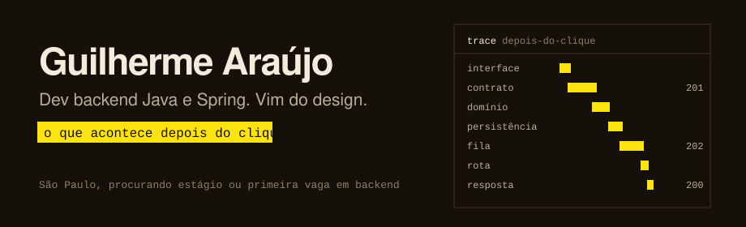

 

## Sobre

Vim do design. Trabalho com UX/UI na Lojas Marisa desde 2025, e por muito tempo eu entregava a tela
e outra pessoa decidia como o dado ia ser guardado, validado e devolvido. Fui aprender essa parte.

Hoje estudo Ciência da Computação na Anhembi Morumbi (formatura em 2028) e escrevo API em Java e
Spring. Procuro estágio ou primeira vaga em backend, em São Paulo ou remoto.

O que veio do design eu não larguei: quando desenho uma resposta de erro, penso em quem vai ler
ela tentando descobrir por que a integração quebrou.

## Três APIs, com teste no CI

| Projeto | O que resolve | Prova |
|---|---|---|
| [**E-commerce API**](https://github.com/Guilhr-07/ecommerce-api) | Catálogo aberto para leitura, escrita só para ADMIN. JWT, BCrypt, upload de imagem, Swagger | 9 endpoints, 15 testes |
| [**Controle Financeiro API**](https://github.com/Guilhr-07/controle-financeiro-api) | Gastos com resumo mensal. O Postgres soma, não o Java, e todo valor é BigDecimal | 2 consultas JPQL agregam no banco, 9 testes |
| [**Gestor de Tarefas API**](https://github.com/Guilhr-07/gestor-tarefas-api) | CRUD com camadas separadas e todo erro no formato da RFC 7807 | 8 testes |

Java 21, Spring Boot, Spring Data JPA, PostgreSQL, Flyway, JUnit 5, Docker e
GitHub Actions nas três. Cada README tem a seção "O que ficou de fora".

O case de cada uma, com o que eu escolhi e por quê, está em
[guilherme-portfolio.dev](https://guilherme-portfolio.dev).

## Agora

- **Estudando:** deploy de uma das APIs na AWS com GitHub Actions, depois Kafka.
- **Ainda não sei:** AWS e mensageria em produção. Está na fila, com data.

 

